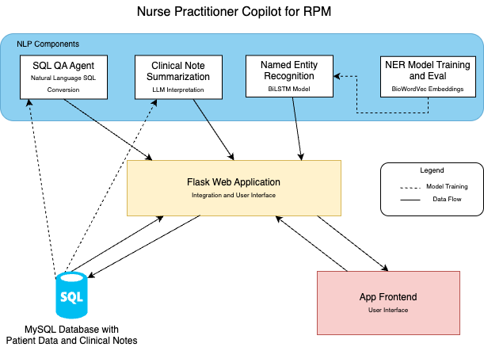
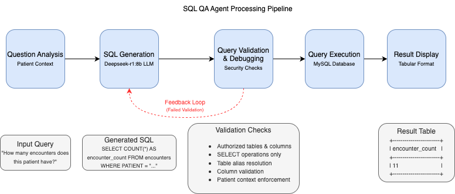

# Nurse Practitioner Copilot for Remote Patient Monitoring (RPM)

An NLP-based Clinical Decision Support System for streamlining nurse practitioner workflows in remote patient monitoring settings.

## Overview

The Nurse Practitioner Copilot integrates multiple NLP technologies to address key challenges in RPM workflows:

- Natural language access to patient databases without SQL expertise
- Efficient summarization of lengthy clinical notes
- Automated extraction of clinical entities from unstructured text
- Risk stratification of patients using vitals data

This system aims to reduce documentation burden, improve information access, and enhance clinical decision-making for nurse practitioners managing remote patients.

## System Architecture



The system consists of four primary NLP components:

1. **SQL QA Agent**: Translates natural language questions into secure SQL queries
2. **Clinical Note Summarization**: Condenses lengthy documentation while preserving clinical information
3. **Named Entity Recognition**: Identifies and classifies clinical entities in notes
4. **NER Model Training Pipeline**: Trains and evaluates the NER model

These components are integrated through a Flask web application that interacts with a MySQL database storing patient data and clinical notes.
## Setup Steps

1. **Install Ollama**

   **Mac/Linux:**
   ```bash
   brew install ollama
   ollama serve
   ollama pull deepseek-r1:8b
  **Windows:**
  Download and install Ollama from: https://ollama.com/download
  ```bash
  ollama serve
  ollama pull deepseek-r1:8b
  ```

2. Clone the repository
  ```bash
  git clone https://github.com/abhinav-dholi/CS6120_Team_102
  cd CS6120_Team_102
  ```

3. Set up the MySQL database
  ```bash
  CREATE DATABASE rpm_database;
  mysql -u <your_username> -p rpm_database < database_creation/rpm_dataset_dump_updated.sql
  ```

4. Create and activate Python virtual environment
  **Mac/Linux:**
  ```bash
  python3.11 -m venv venv
  source venv/bin/activate
  ```
  **Windows:**
  ```bash
  python -m venv venv
  venv\Scripts\activate
  ```

5. Install Python dependencies
  ```bash
  pip install --upgrade pip
  pip install -r RPM_Copilot/requirements.txt
  ```

6. Run the application
  ```bash
  python RPM_Copilot/app.py
  ```
Open http://127.0.0.1:5000/ in your browser to access the application.

## Usage

### Homepage
- Search for patients by name
- View triage dashboard with patient MEWS scores and risk levels

### Patient Search
- Enter patient names to locate specific records
- View basic patient information with options to access details

### Patient Details
- Access demographic information and clinical history
- Enter natural language queries about patient data
- View structured results from SQL queries

### Clinical Notes
- Generate concise summaries of individual notes
- Create yearly summaries across multiple notes
- View named entities highlighted within clinical documentation

## System Components

### SQL QA Agent
- Translates natural language into patient-specific SQL queries
- Implements security validation with AST-based parsing
- Features intelligent debugging with error feedback and query correction
- Achieves 90% accuracy on nurse-generated queries with 100% recall


### Clinical Note Summarization
- Employs chunking methodology for handling lengthy documentation
- Implements multi-stage processing with partial summarization and consolidation
- Preserves critical clinical information while reducing documentation length
- Supports both single-note and longitudinal (yearly) summarization

### Named Entity Recognition (NER)
- Identifies 78 distinct clinical entity types using BIO tagging
- Utilizes BiLSTM neural network with BioWordVec embeddings
- Contains 1.83M parameters (1.69M non-trainable embedding parameters)
- Achieves 95% token-level accuracy and 71% entity-level F1-score

## Technologies Used

- **Backend**: Flask, Python 3.11
- **Database**: MySQL
- **NLP Frameworks**: LangChain, Ollama
- **LLM Models**: DeepSeek-r1:8b
- **Machine Learning**: TensorFlow, Keras, BioWordVec embeddings
- **NLP Processing**: SpaCy, displaCy

## Code Structure
```
.
|-- database_creation/
|   |-- output/
|   |   `-- creating_tables_indexes.sql
|   |-- notes_data_to_db.py 
|   `-- rpm_dataset_dump_updated.sql
|
|-- diagrams/
|
|-- ner_clinical_notes/  
|   |-- data/               
|   |   |-- models/
|   |   |-- processed/
|   |   `-- raw/
|   |
|   |-- notebooks/    
|   |   |-- 1_EDA.ipynb
|   |   |-- 2_data_preprocessing.ipynb
|   |   `-- 3_model_training.ipynb
|   |
|   |-- src/   
|   |   |-- config.py
|   |   |-- data_utils.py
|   |   |-- evaluate.py
|   |   `-- model.py
|   |
|   `-- requirements.txt    
|
|-- RPM_Copilot/    
|   |-- app.py   
|   |-- config.py
|   |-- ner_model.h5          
|   |-- requirements.txt            
|   |-- test_sql_qa.ipynb
|   |-- tokenizer.pickle
|   `-- templates/               
|       |-- index.html
|       |-- patient_clinical_notes.html
|       |-- patient_detail.html
|       `-- search_results.html
|
`-- README.md
```
## Contributors

- **Abhinav Dholi** - SQL QA Agent, NER model development, Database architecture, Note summarization
- **Feng Hua Tan** - Patient risk assessment, NER visualization, Web application interface, Triage functionality

## Limitations and Future Work

### Current Limitations
- Limited training data (only 200 annotated documents)
- Entity class imbalance affecting rare entity recognition
- LLM context window limitations requiring chunking approach

### Future Directions
- Transformer-based sequence labeling with medical BERT variants
- Enhanced temporal reasoning for patient trends
- Multi-modal integration with wearable device data
- Explainable AI for clinical decision support
- Interface improvements based on real-world usage


## Acknowledgments

This project was developed under the guidance of Professor Amir Tahmasebi for CS 6120: Natural Language Processing at Northeastern University.
